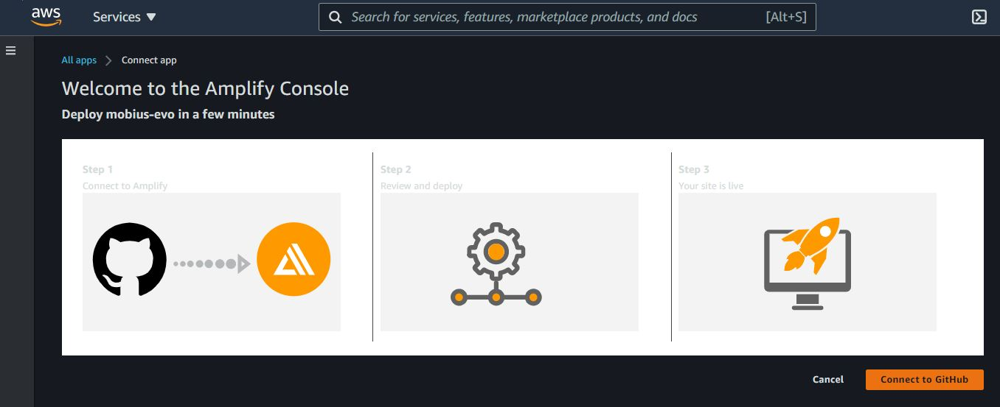

# Mobius Evolver
Cloud-based Evolutionary Optimisation for Mobius Modeller.

## Requirements
Mobius Evolver has been tested and built on AWS Cloud Environment.
To get started, you will require an [aws account](https://aws.amazon.com/).

### AWS
With your AWS account (May 2021):
* you get 25GB of free storage on Dynamo DB (does not expire),

* you get the first 1 million Lambda function executions per month for free (does not expire), and

* for the the first 12 months after opening your account, you get 5GB of free storage on S3.

When you are running Mobius Evolver search that has a total of 1000 designs, then it will result in 2001 Lambda executions.  This means that you can run 499 of such searches every month without incurring any costs.  You may still incur some storage costs depending on how long you save the results, but these costs are very low. (May 2021, S3 storage cost is $0.023 / GB).

For more information on the AWS free tier, see [https://aws.amazon.com/free/](https://aws.amazon.com/free/)
For more information of AWS S3 storage costs, see [https://aws.amazon.com/s3/pricing/](https://aws.amazon.com/s3/pricing/)

### Install

1. Connect to GitHub

1. Select a service role and deploy

## Uninstall
